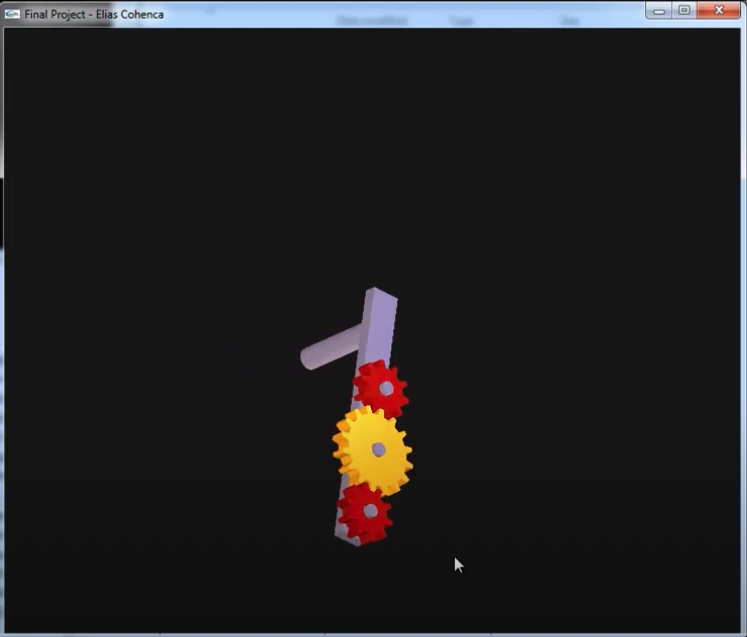

# CAD Systems Course Project (2006)
 
Loads an OFF model and displays it using OpenGL.

## NOTES:
Use the up & down directional keys to zoom in & out.

Select a gear with Ctrl key pressed to make it transparent.

Use mouse left-button to rotate model. Rotating with shift key	pressed makes the model continue the rotation after releasing the mouse button.

'S' & 'D' (caps-independent) animates the gears & model.
'O'(also caps-independent) changes between orthographic and perspective views.

Right-clicking brings up the options menu, from here you can change the gear configuration and turn on/off the lights.
There's also a reinitialize option to go back to the initial default states.

First light is located on the model and rotates with it.
Second light comes straight from the viewer and it's fixed.
The third light is a spotlight located in the upper-right corner (and slightly in front) of the screen.
